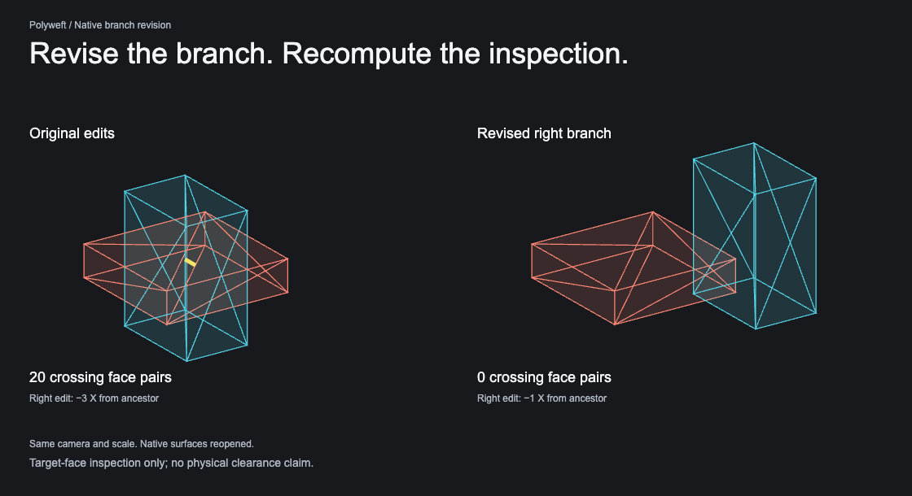

<p></p>

# Polyweft

**Merge Blender mesh edits. See what their combination creates.**

Two artists can edit different vertices without a value conflict and still create crossing surfaces. Polyweft reconciles prepared native `.blend` branches, then traces the same face pair through ancestor, left, right and configured result.

[Inspect the crossing-surface case](https://nazeeh111.github.io/Polyweft/interference/) · [Resolve competing edits](https://nazeeh111.github.io/Polyweft/) · [Releases](https://github.com/nazeeh111/Polyweft/releases)

<picture>
  <source media="(max-width: 650px)" srcset="docs/interference-mobile.gif">
  
</picture>

The original recording uses the published Blender 4.5.14 inspection, not a native browser write. [Original recording and source identities](docs/PRESENTATION.md).

## Revise the branch, then inspect again

The new [native revision case](docs/presentation/README.md) follows the complete loop: **20 crossing face pairs → revise the right branch in Blender → replan and inspect → 0 represented-face crossings → apply and freshly reopen**. Both results retain the same prepared topology. Zero here concerns the stated represented-face model, not whole-scene collision or physical clearance.

<picture>
  <source media="(max-width: 650px)" srcset="docs/presentation/revision-mobile.png">
  
</picture>

[Portable native case and complete software source](docs/presentation/native-revision.zip) · [Exact recorded geometry](docs/presentation/revised-inspection.json) · [True phone capture](docs/presentation/revised-375.png).

## Run the native workflow

Python 3.11+ and a trusted local Blender executable are required. There are no Python runtime dependencies, accounts or model services.

```sh
python -m pip install .
polyweft prepare model.blend --object Shell --output base.blend --blender /path/to/blender
# Branch from prepared base.blend, then save left.blend and right.blend.
polyweft plan base.blend left.blend right.blend --output review --blender /path/to/blender
polyweft studio review --port 0
```

In this source preview, the browser is read-only. Use the native extension panel below for whole-value choices, or supply decisions.json to the existing CLI. The browser compares captured geometry; it does not save Blender files.

```sh
polyweft inspect review --decisions decisions.json --output inspected --blender /path/to/blender
polyweft studio inspected --port 0
polyweft apply review --decisions decisions.json --output merged.blend \
  --accept-payload-scope --blender /path/to/blender
```

Omit decisions for a conflict-free plan. Inspect again after changing choices or branch geometry. Inspection neither saves a scene nor gates apply; native apply separately rechecks exact sources and payload, saves a new file and freshly reopens it. Existing outputs, changed sources, unresolved conflicts and unsupported structure are refused.

## Work inside Blender · extension preview

The new native panel brings saved-file selection, whole-value choices, inspection and verified saving into Blender. It uses Blender's bundled Python, so the installed extension needs no pip, system Python or executable-path setup. Your active scene stays untouched. The browser becomes a read-only inspection snapshot; choices stay in the Blender panel.

[Download the extension ZIP](https://github.com/nazeeh111/Polyweft/releases/download/v0.3.0-preview.1/polyweft-0.3.0.zip) or [see the preview release and checksum](https://github.com/nazeeh111/Polyweft/releases/tag/v0.3.0-preview.1). The installed operator workflow passed on Blender 5.2.1 LTS for macOS arm64 and on Blender 4.5.14 LTS for Linux x64. Hands-on panel acceptance is pending. [Verification status](docs/VERIFICATION.md#native-extension-preview)

Install it through **Preferences → Get Extensions → Install from Disk**, enable Polyweft, then open **3D View → Sidebar → Polyweft**.

1. Prepare a saved ancestor before branching, then choose the ancestor, left and right files.
2. Create a review and choose each competing whole value in the panel.
3. Inspect the four saved states in the read-only browser view.
4. Accept the limited payload scope and save to a new merged-copy path.

Changing a choice or a monitored source-file property revokes the inspection and scope acceptance. Saving always rechecks source hashes and native captures. The extension targets macOS arm64 and Linux x64 with Blender 4.5+ and its matching bundled standalone Python; Windows is unavailable. [Full native workflow, recovery and cancellation](docs/BLENDER.md)


## Scope

- Reconcile complete XYZ vectors, per-corner UV pairs and admitted Principled Base Color/Roughness inputs. It never mixes coordinate axes to invent a value.
- Prepare before branching; retain durable identities and unchanged topology. Outside the admitted payload, **everything comes from right**. This is not a whole-scene merge or arbitrary mesh correspondence.
- Surface inspection covers distinct native target polygon faces in object-local coordinates. Incomplete coverage never establishes separation. Other objects, solid containment, within-face folding, evaluated modifiers, artistic intent and physical tolerances remain outside scope.

The new case ran on installed **Blender 5.1.2**, with 33 native/core Python tests and 13 Node tests passing. It does not replace the published Linux 4.5 LTS acceptance or establish held extension/workflow changes. Blender auto-execution is disabled; a trusted executable and trusted artwork are still required.

[Full original guide](TECHNICAL_GUIDE.md) · [Merge contract](docs/CONTRACT.md) · [Inspection limits](docs/INTERFERENCE.md) · [Original verification](docs/VERIFICATION.md) · [Contributing](CONTRIBUTING.md).

Licensed [GPL-3.0-or-later](LICENSE). User artwork and data remain their authors' property. No hardware or fabrication claim.
